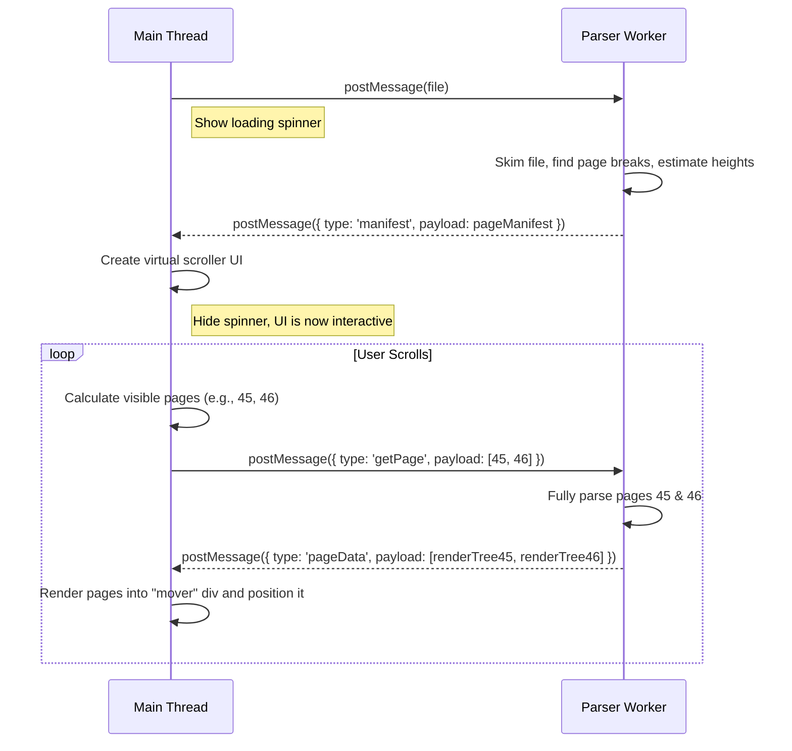

# Comprehensive Plan for Handling Very Large Documents

## The Core Problem with Large Documents

For a 1000-page document, the initial "parse-then-render" approach will fail, even with a Web Worker. The browser would crash trying to render a million DOM nodes and would exhaust its memory.

1.  **Worker Memory**: Parsing a 1000-page document and building a complete "render tree" for it could exhaust the memory allocated to the Web Worker.
2.  **Main Thread Memory**: Sending a massive render tree object from the worker to the main thread could cause memory spikes and crashes.
3.  **DOM Overload**: Even if the data transfer succeeds, the main thread cannot possibly render the DOM for 1000 pages at once. The browser would become unresponsive and likely crash.

## The Solution: The "Streaming" Parser Worker + Virtualized Scroller

The solution is to combine the Parser Worker with two advanced techniques: On-Demand Parsing and UI Virtualization (or "Windowing"). The strategy is to never hold the full document in memory on the main thread and to only parse and render what is absolutely necessary.

### Phase 1: The Worker's Initial "Skim"

The Parser Worker's first job is not to parse everything, but to skim the document to build a "Table of Contents" and a "Layout Manifest."

1.  **Partial Parse**: The worker opens the iWork file and does a fast initial pass. It does not build a detailed render tree.
2.  **Identify Page Boundaries**: It locates the data corresponding to page breaks.
3.  **Calculate Page Heights**: It calculates the approximate height of each page based on its content (number of lines, images, etc.). This doesn't have to be pixel-perfect initially.
4.  **Build a Manifest**: It creates a lightweight manifest array.
    *   Example Manifest: `[{ page: 1, height: 850 }, { page: 2, height: 1200 }, ...]`
5.  **Send Manifest to Main Thread**: The worker sends this small manifest array (and perhaps a table of contents) to the main thread. The full document data remains in the worker.

### Phase 2: The Main Thread's "Virtual Scroller"

The main thread now has the metadata it needs to create the illusion of a fully rendered document.

1.  **Calculate Total Height**: It sums the heights from the manifest to get the total scrollable height of the document (e.g., 1000 pages * ~900px/page = 900,000px).
2.  **Create a "Sizer" Element**: It creates an empty `
` with `height: 900,000px`. This creates a scrollbar of the correct size.
3.  **Create a "Viewport" Element**: This is the visible container the user sees, with `overflow: scroll`.
4.  **Create a "Mover" Element**: Inside the viewport, it creates an absolutely positioned `
` that will hold the currently visible page content.

### Phase 3: On-Demand Rendering on Scroll

This is where the magic happens.

1.  **Listen to Scroll Events**: The main thread listens for scroll events on the viewport.
2.  **Determine Visible Pages**: On each scroll, it calculates which pages should be visible based on the `scrollTop` position. For example, at `scrollTop: 1800px`, it knows page 3 should be visible.
3.  **Request Pages from Worker**: If the render trees for the visible pages are not already in a local cache, the main thread requests them from the worker: `worker.postMessage({ type: 'getPage', payload: [3, 4] })`.
4.  **Worker Parses on Demand**: The worker receives the request, goes back to its full dataset, fully parses only pages 3 and 4, creates their specific render trees, and sends them back.
5.  **Main Thread Renders and Positions**: The main thread receives the render trees. It clears the "mover" div, renders the new pages into it, and positions it using `transform: translateY(1800px)`.

This ensures that only 2-3 pages worth of DOM nodes are ever in the document at one time, regardless of its total length.

## New Interaction Diagram

## Handling Complexities

*   **Search ("Find")**: A standard Ctrl+F will not work. You must implement a custom search UI. The search query is sent to the worker, which searches the full document model. The worker then returns the page number of the result, and the main thread can command the virtual scroller to jump to that page.
*   **Performance**: Throttling the scroll event is crucial to avoid flooding the worker with requests.

This architecture is complex but is the standard, proven method for building high-performance viewers for large documents or long lists, used by applications like Google Docs, VS Code, and Figma.
